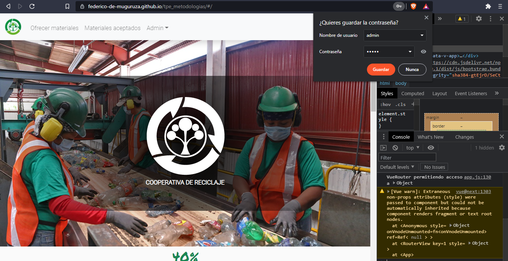

# Test Template

<table style= "width: 100%">
  <tr>
    <th> Proyect Name </th>
    <td> Cooperativa-reciclaje</td>
    <th> Test Case ID </th>
    <td> #CR-212/1 </td>
  </tr>
  <tr>
    <th> Version </th>
    <td> MPV </td>
    <th> Iteration No. </th>
    <td> 3 </td>
  </tr>
   <tr>
    <th> Tested By </th>
    <td> Evelyn Vega </td>
    <th> Browser </th>
    <td> Brave </td>
  </tr>
  <tr>
    <th colspan="1"> Tested On </th> 
    <td colspan="3"> #CR-212 "Error en conexión con API desde gitPages y Liveserver"</td>
  </tr>
   <tr>
    <th colspan="1"> Description </th>
    <td colspan="3"> 
    Como se implementó un 404 como defaultRoute en la api, las preflight requests (que hace CORS para ver si el origin está autorizado para hacer un fetch que no sea GET) fallaban (devolvia un 404).  
    Al agregar al ruteo la misma ruta, pero de tipo OPTIONS, devolvía un 400 (porque esa preflight request no es la request original, sirve para saber si tiene autorización para enviar la request original)  
    Si usabamos el modo default para enviar formularios de html no hubiese pasado  
  </tr>
   <tr>
    <th colspan="1"> Made By </th>
    <td colspan="3"> Federico Franchini</td>
  </tr>
</table>

 

|Test # | Date | Action | Expected Results | Actual Results | Pass :question: |
| ---   | ---  | ---    | ---              |   ---          | ---   |
| 1 | 08/07 | loguearse (comunicarse con la API)  | Se deberá poder utilizar el sitio desde Gitpages, eso incluye logueo y otras comunicaciones necesariascon la API | Se puede ingresar y utilizar el sitio como corresponde | si |
| <td colspan=6>|

