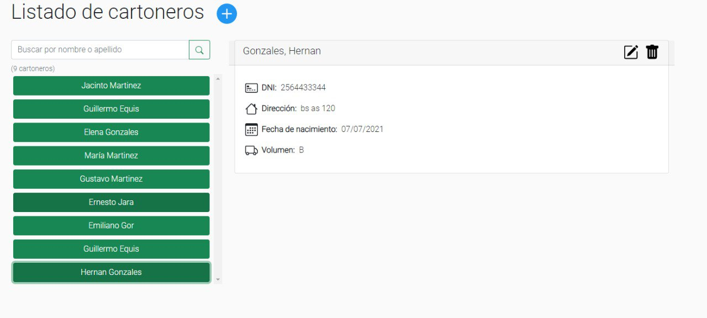
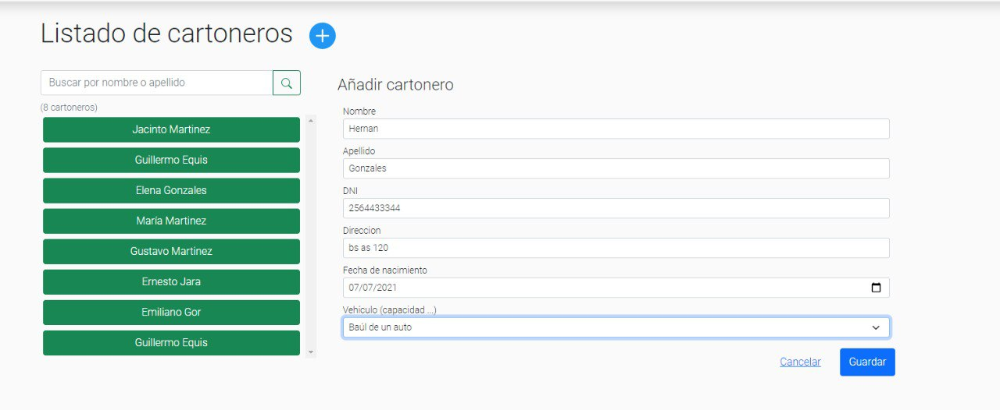
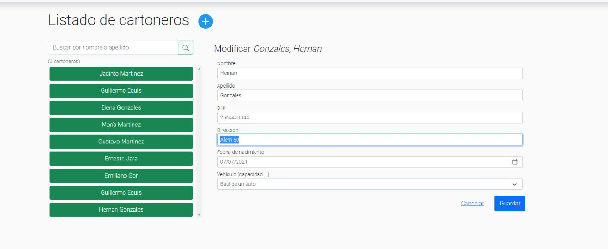
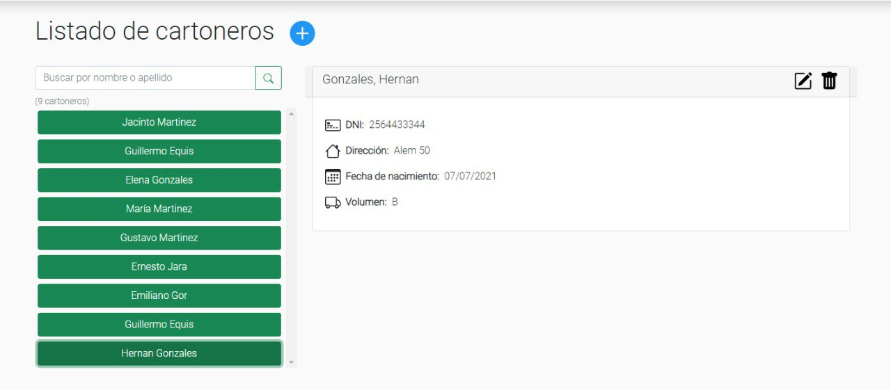

# Test Template

<table style= "width: 100%">
  <tr>
    <th> Proyect Name </th>
    <td> Cooperativa-reciclaje</td>
    <th> Test Case ID </th>
    <td> #CR-182/1 </td>
  </tr>
  <tr>
    <th> Version </th>
    <td> MPV </td>
    <th> Iteration No. </th>
    <td> 3 </td>
  </tr>
   <tr>
    <th> Tested By </th>
    <td>Nicolas Contreras</td>
    <th> Browser </th>
    <td> Brave </td>
  </tr>
  <tr>
    <th colspan="1"> Tested On </th> 
    <td colspan="3"> #CR-182 "Implementar interfaz del abm de cartoneros"</td>
  </tr>
   <tr>
    <th colspan="1"> Description </th>
    <td colspan="3"> Criterios de aceptación:
        <li> Se deberá poder agregar un cartonero
        <li> Se deberá poder modificar un cartonero
        <li> Se deberá poder eliminar un cartonero
        <li> Se debe chequear que esta sección no sea accesible por los ciudadanos
        
    </td>
  </tr>
   <tr>
    <th colspan="1"> Made By </th>
    <td colspan="3"> Federico Franchini </td>
  </tr>
</table>

 

|Test # | Date | Action | Expected Results | Actual Results | Pass :question: |
| ---   | ---  | ---    | ---              |   ---          | ---   |
| 1 | 07/07/2021 | se debera poder agregar  un cartonero | el cartonero sea agregado. | el cartonero es agregado  | Sí |
| <td colspan=6>|
| <td colspan=6>|
| 1 | 07/07/2021 | se debera poder editar  un cartonero | el cartonero sea editado. | el cartonero es editado  | Sí |
| <td colspan=6>|
| <td colspan=6>|
| 1 | 07/07/2021 | se debera poder eliminar  un cartonero | el cartonero sea eliminado. | el cartonero es eliminado | si |
| 1 | 07/07/2021 | Se debe chequear que esta sección no sea accesible por los ciudadanos | la seccion no sea accesible por los ciudadanos. |la pagina es accesible. falta chequeo de seguridad | no |

