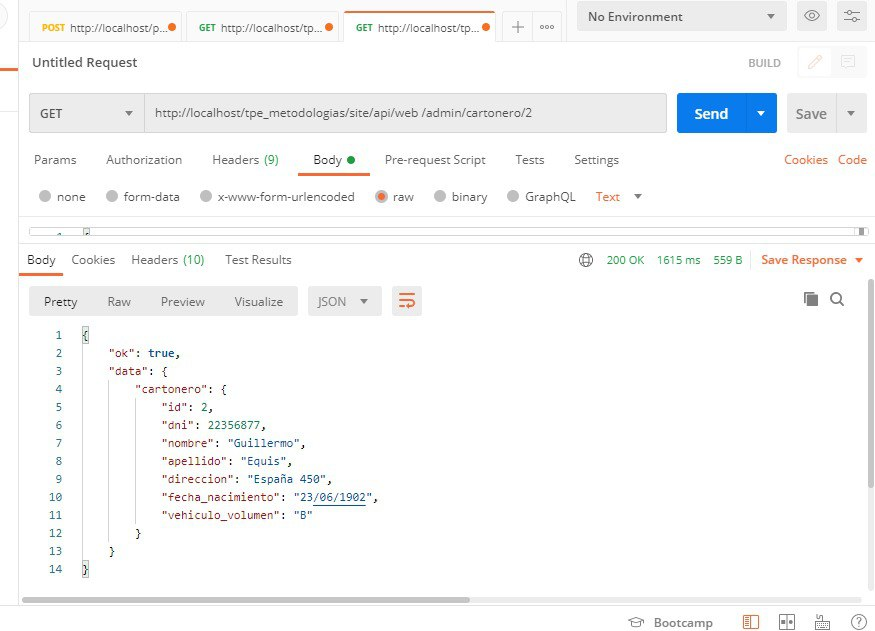

# Test

<table style= "width: 100%">
  <tr>
    <th> Proyect Name </th>
    <td> Cooperativa-reciclaje</td>
    <th> Test Case ID </th>
    <td> #CR-187/1 </td>
  </tr>
  <tr>
    <th> Version </th>
    <td> MPV </td>
    <th> Iteration No. </th>
    <td> 3 </td>
  </tr>
   <tr>
    <th> Tested By </th>
    <td> Nicolas Contreras</td>
    <th> Browser </th>
    <td> Chrome </td>
  </tr>
  <tr>
    <th colspan="1"> Tested On </th> 
    <td colspan="3"> #CR-185 "Implementar servicio api para obtener los datos de un cartonero"</td>
  </tr>
   <tr>
    <th colspan="1"> Description </th>
    <td colspan="3"> Criterios de aceptación:
        <li>Deberá tener el ID del cartonero en cuestión
        <li> Deberá tener nombre
        <li> Deberá tener apellido
        <li> Deberá tener DNI
        <li> Deberá tener dirección
        <li> Deberá tener fecha de nacimiento
        <li>Deberá tener vehículo (volumen que puede cargar)
    </td>
  </tr>
   <tr>
    <th colspan="1"> Made By </th>
    <td colspan="3"> Federico Franchini</td>
  </tr>
</table>

 

|Test # | Date | Action | Expected Results | Actual Results | Pass :question: |
| ---   | ---  | ---    | ---              |   ---          | ---   |
| 1 | 07/07 | obtener datos de un cartonero con un get a "http://localhost/tpe_metodologias/site/api/web /admin/cartonero/2"| ver los datos del cartonero | se obtienen los datos del cartonero | si |
| <td colspan=6>|
