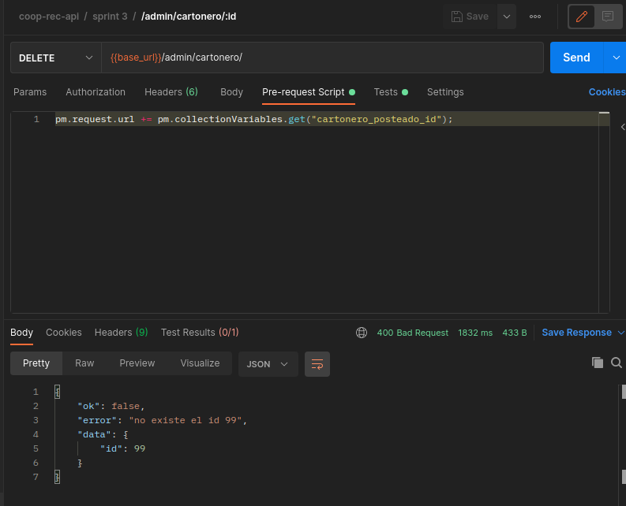
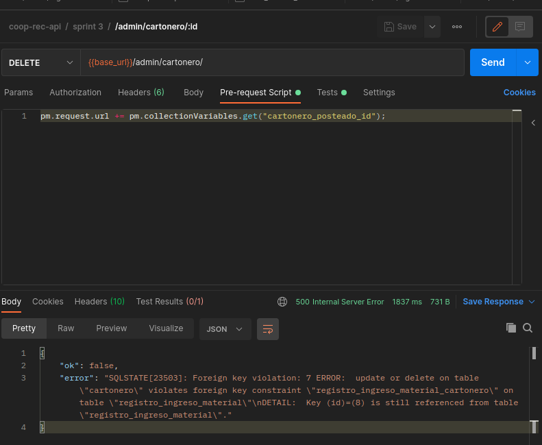
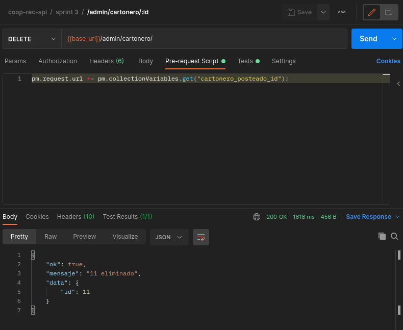
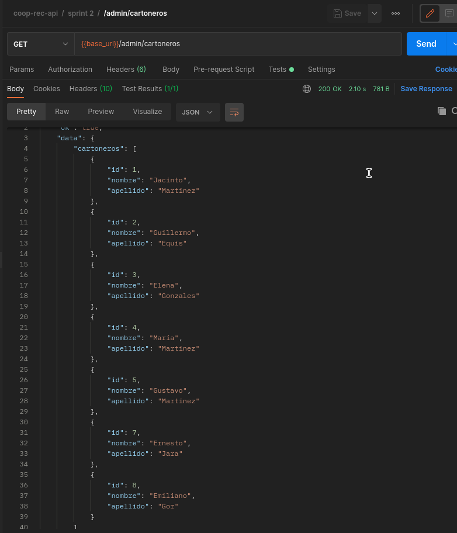

# Test

<table style= "width: 100%">
  <tr>
    <th> Proyect Name </th>
    <td> Cooperativa-reciclaje</td>
    <th> Test Case ID </th>
    <td> #CR-187/1 </td>
  </tr>
  <tr>
    <th> Version </th>
    <td> MPV </td>
    <th> Iteration No. </th>
    <td> 3 </td>
  </tr>
   <tr>
    <th> Tested By </th>
    <td> Federico Franchini </td>
    <th> Browser </th>
    <td> Chrome </td>
  </tr>
  <tr>
    <th colspan="1"> Tested On </th> 
    <td colspan="3"> #CR-187 "Implementar servicio api para dar de baja un cartonero"</td>
  </tr>
   <tr>
    <th colspan="1"> Description </th>
    <td colspan="3"> Criterios de aceptación:
        <li> Deberán existir los datos del cartonero 
        <li> Se deberán eliminar los datos del cartonero sólo si no tiene materiales ingresados a su nombre
    </td>
  </tr>
   <tr>
    <th colspan="1"> Made By </th>
    <td colspan="3"> Evelyn Vega </td>
  </tr>
</table>

 

|Test # | Date | Action | Expected Results | Actual Results | Pass :question: |
| ---   | ---  | ---    | ---              |   ---          | ---   |
| 1 | 05/07 | borrar cartonero con un id que no existe | recibir un error de que no existen los datos | se recibe un error de que no existen los datos | si |
| <td colspan=6>|
| 2 | 05/07 | borrar cartonero con materiales ingresados a su nombre | recibir un error de que no se pueden borrar el cartonero | se recibe un error de que no se puede borrar el cartonero | si |
| <td colspan=6>|
| 3| 05/07 | borrar cartonero sin materiales ingresados a su nombre | recibir notificacion de que se borro el cartonero | se notifica que se borro el cartonero, y ya no aparece en get cartoneros | si |
| <td colspan=6>|
| <td colspan=6>|
