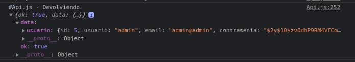
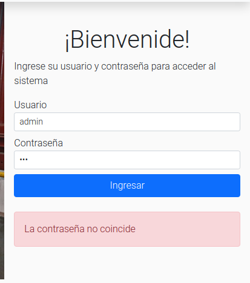

# Test

<table style= "width: 100%">
  <tr>
    <th> Proyect Name </th>
    <td> Cooperativa-reciclaje</td>
    <th> Test Case ID </th>
    <td> #CR-178,#CR-179/1 </td>
  </tr>
  <tr>
    <th> Version </th>
    <td> MPV </td>
    <th> Iteration No. </th>
    <td> 3 </td>
  </tr>
   <tr>
    <th> Tested By </th>
    <td> Federico Franchini </td>
    <th> Browser </th>
    <td> Chrome </td>
  </tr>
  <tr>
    <th colspan="1"> Tested On </th> 
    <td colspan="3"> #CR-179 "Implementar interfaz del logueo de secretaria"
    </td>
  </tr>
   <tr>
    <th colspan="1"> Description </th>
    <td colspan="3"> Criterios de aceptación:
        <li> Debera validar usuario
        <li> Debera validar contraseña
    </td>
  </tr>
   <tr>
    <th colspan="1"> Made By </th>
    <td colspan="3"> Evelyn Vega </td>
  </tr>
</table>

 

|Test # | Date | Action | Expected Results | Actual Results | Pass :question: |
| ---   | ---  | ---    | ---              |   ---          | ---   |
| 1 | 05/07 | ingresar usuario "admin" y contraseña "admin" | recibir notificacion de login exitoso | log en consola de la respuesta de la api muestr ok "true" y los datos del usuario  | si |
| <td colspan=6>|
| 2 | 05/07 | ingresar usuario "admin" y contraseña "123" | recibir notificación de error | se muestra un mensaje que dice contraseña invalida | si |
| <td colspan=6> |