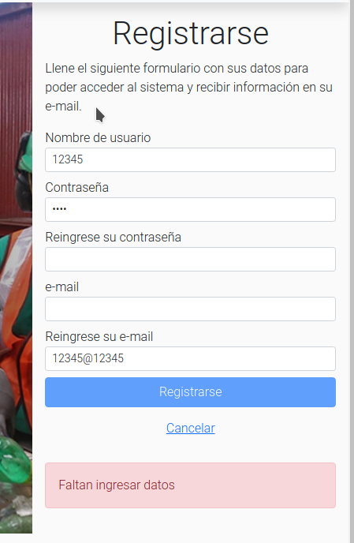

# Test

<table style= "width: 100%">
  <tr>
    <th> Proyect Name </th>
    <td> Cooperativa-reciclaje</td>
    <th> Test Case ID </th>
    <td> #CR-192/1 </td>
  </tr>
  <tr>
    <th> Version </th>
    <td> MPV </td>
    <th> Iteration No. </th>
    <td> 3 </td>
  </tr>
   <tr>
    <th> Tested By </th>
    <td> Federico Franchini </td>
    <th> Browser </th>
    <td> Chrome </td>
  </tr>
  <tr>
    <th colspan="1"> Tested On </th> 
    <td colspan="3">
      <li> #CR-192 "Implementar interfaz del registro de secretaria"
    </td>
  </tr>
   <tr>
    <th colspan="1"> Description </th>
    <td colspan="3"> Criterios de aceptación:
        <li> deberá registrarse con nombre de usuario, contraseña, mail
        <li> deberá validar mail pidiendo que se reingresen dos veces
        <li> deberá validar contraseña pidiendo que se reingrese dos veces
    </td>
  </tr>
   <tr>
    <th colspan="1"> Made By </th>
    <td colspan="3"> Evelyn Vega </td>
  </tr>
</table>

 

|Test # | Date | Action | Expected Results | Actual Results | Pass :question: |
| ---   | ---  | ---    | ---              |   ---          | ---   |
| 1 | 05/07 | registrarse con usuario, contraseña, mail | recibir notificacion de registro valido al ingresar bien los datos | se ve un modal con el mensaje de la api | si|
| <td colspan=6>|
| 1 | 05/07 | registrarse con usuario, contraseña, mail | ver un error si no se ingresa algun dato requerido | se ve un alert con el error correspondiente | si|
| <td colspan=6>|
| 2 | 05/07 | validar contraseña  | ver un error si se reingresa mal la contraseña | se ve un alert con el error correspondiente | si |
| <td colspan=6>|
| 2 | 05/07 | validar mail  | ver un error si se reingresa mal el mail | se ve un alert con el error correspondiente | si |
| <td colspan=6>|

