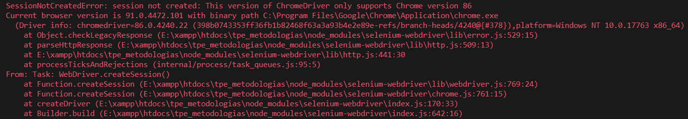

# Instalación selenium-cucumber-js 
Framework de js para la automatizacion de tests, se puede ver la documentacion [aquí](https://www.npmjs.com/package/selenium-cucumber-js#configuration-file)

## Instalación

### 1. Instalar NodeJS y selenium-cucumber-js

- Instalar [NodeJS](https://nodejs.org/es/download/) 

- En la consola, dentro de la carpeta del proyecto, ejecutar el siguiente comando:
```
npm install selenium-cucumber-js --save-dev
```

### 2. Configurar las rutas

- En *tpe_metodologias\node_modules\selenium-cucumber-js\index.js* (siendo tpe_metodologias la carpeta del proyecto)

#### Opcion 1: cambiar la variable ```config``` de la Línea 25 por
```js json
var config = {
    steps: './testing/features/step_definitions',
    pageObjects: './testing/features/page_objects',
    sharedObjects: './testing/features/shared_objects',
    featureFiles: './testing/features',
    reports: './testing/features/reports',
    browser: 'chrome',
    browserTeardownStrategy: 'always',
    timeout: 15000
};
```

#### Opcion 2: cambiar la variable ```configFileName``` de la línea 36 por
```js
var configFileName = path.resolve(process.cwd(), './testing/selenium-cucumber-js.json');
```

## Testing

Comando para iniciar el test: 
```
node ./node_modules/selenium-cucumber-js/index.js
```

### En caso de error de ChromeDriver



- Buscar y descargar el driver indicado desde [aquí](https://chromedriver.storage.googleapis.com/index.html)
- Copiar el archivo comprimido en *tpe_metodologias\node_modules\chromedriver\lib\chromedriver* (siendo tpe_metodologias la carpeta del proyecto)
- descomprimir el chromedriver.exe ahi mismo (el que esta destro del archivo descargado)